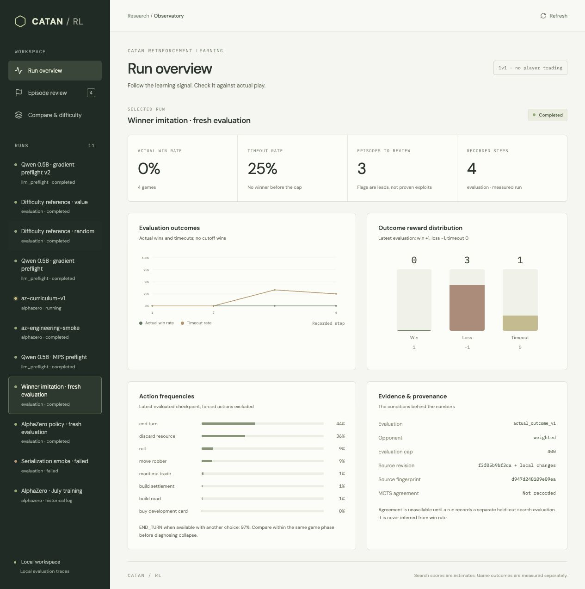

# catan-rl

I'm building a Catan agent to learn tree search, self-play, and reinforcement learning. The algorithms are hand-written in Python/PyTorch; [Catanatron](https://github.com/bcollazo/catanatron) supplies the rules and benchmark opponents. Everything runs on an M-series Mac.

Inspired by [Eric Jang's AlphaGo rebuild](https://www.dwarkesh.com/p/eric-jang). Catan adds dice, hidden cards, and multiple opponents, so I tackle those one at a time.

## Results so far

Pure MCTS reached **82% against `weighted`** and 90% against `random` and `vp` in the original benchmark (100 simulations, 120-turn rollout horizon). Those are search results. The learned policy is still weak.

The latest AlphaZero run completed 40 iterations in 3h 23m. It missed the pre-registered target of 60% actual wins against `weighted`:

| Agent | Wins | Losses | Timeouts |
| --- | ---: | ---: | ---: |
| Starting checkpoint + search | 1 | 60 | 39 |
| Trained checkpoint + search | 0 | 69 | 31 |
| Starting policy alone | 0 | 70 | 30 |
| Trained policy alone | 0 | 64 | 36 |

Each row uses the same 50 held-out board seeds in both seats. A timeout is never a win. Older AlphaZero scores of 20–23% counted VP leaders at the turn cap, so they are not comparable to these results.

The main lesson so far: a better training score can hide bad play. Winner imitation reduced loss from 4.1 to 0.8 without improving the old evaluation score. In a fresh four-game diagnostic, that policy chose END_TURN in 97% of eligible decisions. The dashboard makes those decisions inspectable; this is suspicious behavior, not proof of a learned reward exploit.

The first LLM experiment also failed its fixed success rule:

| Qwen 0.5B policy | Held-out MCTS agreement | Wins vs `weighted` |
| --- | ---: | ---: |
| Untuned | 53.9% | 12/20 |
| Supervised imitation | 68.0% | 0/20 |
| GRPO | 67.2% | 10/20 |

GRPO gained 13.3 agreement points, but the observed win rate fell by ten points. The paired-board 95% interval for that change is -30 to +15 points, so this small experiment does not establish a real decline. It still fails the pre-registered rule.

Output validity rose from 82% to 100% on held-out states. On the 61 states where the teacher distinguished actions, agreement moved only from 29.5% to 31.1%. A uniform legal choice scores 68.8% on the full set because ties are common. The untuned game baseline also used random legal fallbacks on 26% of decisions; neither trained policy needed them. Better formatting is clear; better strategy is not.

[Results and paired comparisons](examples/results.json) include both failed experiments. No reward exploit has been established.

## Reward audit

The audit does **not recommend more training** with the current labels:

- Always choosing the last legal action scores 71.1% held-out agreement, above GRPO's 67.2%. This control has not been tested in full games.
- All actions tie in 77/192 training states. The SFT tie rule targets END_TURN in 65/88 states where it is available. That is a possible contributor to passing, not a proven cause.
- Of 24 fixed reliability-panel states, 16 matched the saved prompts and legal menus; eight did not. Only seven of those 16 passed the three-search repeatability check. The full-panel estimate remains incomplete. Full hidden states were not saved, so a matching prompt cannot verify exact hidden-state recovery.

The [report](examples/runs/reward-audit-v1/audit.json) retains every audited state and attempted panel unit. The dashboard shows controls, quality checks, boards, and repeated action values ([preview](examples/reward-audit.png)). Thresholds are in the [plan](PLAN.md); this is a retrospective audit of an already observed failure. The panel attempt took 84 seconds on CPU. No new training updates were made.

Next: preserve fully replayable states and diagnose action-order sensitivity before changing the reward. Game seeds alone were insufficient in this audit. Catanatron generates some action menus from sets; their role in the failed replays has not been isolated. The [learning exercises](LEARNING.md) walk through the implementation and these findings.

<details>
<summary>Reproduce the audit</summary>

The [318 KB input archive](examples/reward-audit-inputs.zip) contains the original label files, evaluation predictions and manifests, the audit's source snapshot, and the interrupted first attempt. That attempt hit a reporting bug on missing evidence; the corrected attempt kept the same cohort and thresholds. Neither attempt changed the original experiment.

```bash
uv run python -m zipfile -e examples/reward-audit-inputs.zip runs/audit-inputs
uv run python -m catan_rl.audit --static-only \
  --dataset runs/audit-inputs/dataset --untuned runs/audit-inputs/untuned \
  --sft runs/audit-inputs/sft --grpo runs/audit-inputs/grpo --out runs/audit-static
uv run python -m catan_rl.audit --check-run examples/runs/reward-audit-v1
```

The last command deliberately exits 2: incomplete or failed evidence cannot yield a pass. Static aggregates should reproduce exactly. To attempt fresh teacher searches, cache the pinned tokenizer and repeat the audit command without `--static-only`, using a fresh output directory and `uv run --extra llm`. It uses one worker, a two-hour total limit, and a five-minute limit per state. No model weights are needed.

```bash
uv run --extra llm python -c 'from transformers import AutoTokenizer; from catan_rl.stage6 import MODEL_ID, REVISION; AutoTokenizer.from_pretrained(MODEL_ID, revision=REVISION)'
```

Exact replay and repeat-search outcomes may differ across processes because the old run did not freeze every source of environment nondeterminism. A replay mismatch is recorded and skipped, never replaced. The archive's source snapshot lets you inspect what produced the reported attempt; it does not recover missing full game states.

</details>

## Run it

Requires Python 3.12+ and [uv](https://docs.astral.sh/uv/).

```bash
uv sync
uv run pytest
uv run python -m catan_rl.benchmark mcts:100 weighted -n 50
uv run python -m catan_rl.az --iterations 6 --out runs/az
uv run python -m catan_rl.pool value mcts:60 weighted random vp -n 60
```

Outputs and checkpoints go to the untracked `runs/` directory.

## Dashboard



React/TypeScript + FastAPI. Compare runs, inspect board states and action traces, review timeout and action-collapse flags, and save review notes locally. Historical logs keep their original metric names; missing data stays missing.

```bash
cd dashboard
npm ci
npm run build
cd ..
uv run python -m catan_rl.server
```

Open http://127.0.0.1:8000. Bundled examples include AlphaZero logs and the final LLM comparisons. All 20 game summaries per LLM policy are included, with complete traces for the first paired board. Model checkpoints are not included. Reviews live in `runs/reviews.sqlite3`.

To add an evaluation or import an old log:

```bash
uv run python -m catan_rl.evaluation policy:runs/az6/iter060.pt weighted \
  --games 20 --seed 10000 --out runs/az-policy-eval
uv run python -m catan_rl.telemetry runs/az6.log --out runs/az6-import
```

Or serve the examples with Docker, without PyTorch:

```bash
docker build -t catan-rl-observatory .
docker run --rm -p 127.0.0.1:8000:8000 catan-rl-observatory
```

Mount writable storage at `/app/runs` to retain container review notes. MPS training runs natively on macOS. GitHub Actions checks Python tests, the frontend build, and the Docker API.

## Roadmap

| Stage | Status |
| --- | --- |
| 0. Benchmark harness | Done: seeded games and seat rotation. |
| 1. MCTS | Done: sampled chance nodes for dice, card draws, and steals. |
| 2. AlphaZero | Self-play and policy/value training work; playing strength remains weak. |
| 3. Hidden information | Determinization implemented. Belief tracking remains open. |
| 4. Multiplayer | Four-player Elo pool and per-seat value heads implemented; larger league training pending. |
| 5. Trading and human replay data | Stretch goal. |
| 6. LLM policy | First GRPO/SFT experiment complete; failed the fixed success rule. |

Stage 6 uses Qwen2.5-0.5B-Instruct with LoRA. It selects a legal action ID from a text prompt; cached MCTS action values supply the reward. GRPO is hand-written in PyTorch, with no TRL.

- **6a:** Strict action-ID interface and full-game evaluation implemented.
- **6b:** Game-separated dataset and 200-simulation MCTS labeling implemented.
- **6c:** GRPO and supervised imitation loops implemented, including checkpoint resume.
- **6d:** Held-out agreement, actual wins, invalid answers, and action frequencies recorded. First comparison complete; no playing-strength improvement demonstrated.

The dashboard shows MCTS reward distributions, equal-reward groups, invalid answers, and agreement alongside actual wins. Tiny smoke runs check execution only. The first run improved output validity, without demonstrating stronger play.

<details>
<summary>Evaluation rules and fixed AlphaZero experiment (2026-09-30)</summary>

Only an engine-declared winner counts. Evaluation stops at 400 turns or 8,000 actions. Both seats share each board seed, with agent randomness isolated from environment randomness. Final intervals account for paired boards; the dashboard's interim Wilson intervals do not.

Run manifests record configuration, seeds, source/dependency versions, and checkpoint hashes. Runs are never overwritten. Historical imports cannot recover missing training provenance or sample counts. Training's VP-leader cutoff reward is recorded separately from actual wins.

Flag episodes with at least 30 eligible decisions and at least 90% END_TURN selections, plus timeouts and cutoff leads. Flags call for review. For a difficulty reference, `random` won 7/20 games with three timeouts and `value` won 20/20 against `weighted`, using seeds 10000–10009 in both seats. These small samples measure difficulty for those agents only.

The AlphaZero hypothesis was that longer self-play horizons would reduce cutoff-driven passivity. These settings were fixed before training:

| Setting | Value |
| --- | --- |
| Initialization | Weights from `runs/az6/iter060.pt`; fresh optimizer and replay buffer |
| Training | Seed 611; 40 iterations; 30 games/iteration; 60 simulations/move; 150 training steps/iteration |
| Replay and optimizer | 100,000 samples; persistent Adam state |
| Curriculum | Turn caps 300, 450, 600 across three equal iteration stages |
| Stop | 40 iterations or eight hours; finish the current game and optimizer update |
| Development evaluation | Every five iterations; 20 games; board seeds from 80000 |
| Final evaluation | Last completed checkpoint; 100 games per agent; 50 board seeds from 90000, both seats |
| Comparisons | Starting and trained checkpoints, each with 60-simulation search and policy alone; 400 games total, separately budgeted |
| Success | Search-assisted actual win rate ≥60%, with paired-board 95% lower bound >50% |
| Interval | Percentile bootstrap over board pairs; 10,000 resamples; seed 611 |
| Failure | Report it without extending the budget or selecting the best development checkpoint |

```bash
uv run python -m catan_rl.az --resume runs/az6/iter060.pt \
  --iterations 40 --games 30 --sims 60 --train-steps 150 --seed 611 \
  --curriculum 300,450,600 --hours 8 --eval-every 5 --eval-games 20 \
  --final-eval-games 100 --out runs/az-curriculum-v1
```

Optimizer persistence, budget handling, and RNG isolation changed too, so this experiment cannot isolate the curriculum's effect. New `resume.pt` checkpoints save optimizer, replay, and RNG state; full-state resumes require the same training configuration and a fresh output directory.

</details>

<details>
<summary>Stage 6 fixed experiment (2026-10-01) and laptop measurements</summary>

**Success:** at least +10 percentage points of held-out MCTS agreement over the untuned baseline, with no observed drop in actual win rate against `weighted`. Report uncertainty and negative results. Equal observed win rates do not establish statistical non-regression. Exclude forced decisions; invalid outputs count as disagreement.

Budget per training arm: LoRA rank 8/alpha 16 on attention projections, four prompts per round, four completions per prompt, 200 rounds, two optimizer updates per round, or eight hours. AdamW uses learning rate 1e-5; GRPO uses clip 0.2 and KL coefficient 0.02. Generate action IDs only, at most 16 tokens. Never silently truncate a prompt or legal-action menu.

The full contract is `RULES` in [stage6.py](catan_rl/stage6.py), copied into each run manifest before execution:

- Collect 24 training, eight development, and 16 held-out games from `value` versus `weighted`, starting at seeds 110000, 120000, and 130000. Uniformly sample up to two setup and six play decisions per game. Exclude forced decisions, menus over 100 actions, and prompts over 2,048 tokens; log exclusions.
- Label each state with two determinized development-card worlds, 100 simulations each, and a 120-turn random rollout horizon. Every action must be visited in both worlds. Resource hands remain privileged teacher information. These are noisy proxy values, not ground-truth action quality.
- Reward is `2 * pooled mean value - 1`; invalid output scores -2. Any maximum-value action within 1e-8 counts as agreement. SFT targets the smallest tied ID. Report agreement for a uniform legal policy and for states with a non-flat teacher too.
- Pin Qwen revision `7ae557604adf67be50417f59c2c2f167def9a775`. Both training arms start from the untuned model, use the same prompt schedule, and retain the last checkpoint. SFT matches updates and prompts, not token compute. Save every 25 rounds and on a clean stop.
- Evaluate untuned, SFT, and GRPO policies on the same 20 games, ten board seeds from 170000 in both seats. Greedy decoding; invalid answers use a seeded uniform legal fallback, recorded in traces. Keep the 400-turn/8,000-action caps. Allow four hours per evaluation arm, finishing a board pair; incomplete evaluation makes the result inconclusive. Bootstrap differences by source game or board, never individual decisions or seats.

Run the whole experiment, or add `--smoke` for a disjoint tiny execution check:

```bash
uv run --extra llm python -m catan_rl.stage6 experiment --out runs/stage6-v1
```

Training handles SIGINT/SIGTERM by finishing the current round and saving. Resume with the same arm, dataset, device, and `--resume <checkpoint-directory>` in a fresh `--out` directory.

A no-update probe on an M4 Max with 36 GiB used four prompts of 1,159–1,591 tokens and four completions each. Generation took 0.73–1.27 seconds per group; forward/backward took 2.91–4.12 seconds with one completion at a time. Gradients were finite; 12/16 outputs were valid IDs. MPS driver allocation reached 16.5 GB including cache. This excludes reference scoring, optimizer work, teacher labeling, and game evaluation; it is not a full training throughput or memory estimate.

Prompt review also caught incorrect port-access nodes and missing robber coordinates before training. The corrected interface is `catan_action_v2_ports`.

```bash
uv run --extra llm python -m catan_rl.llm --out runs/qwen-preflight
```

</details>

[MIT License](LICENSE)
